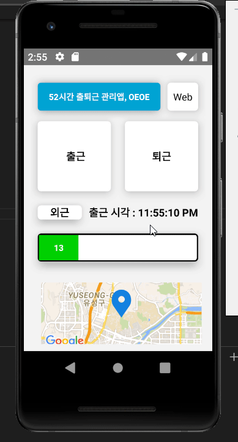

# OEOE

> Operating for Employee Occasions & Exercise

### Tech Stack

>  HTML, Javascript, CSS, Node.js Using REST API, mongoDB, React Native, Android

#### Team Member

- 고태완 : React Native를 이용한 Android 모바일 어플리케이션 개발
- 임승민 : HTML, CSS, Javascript를 이용한 Web 개발
- 최수연 : MongoDB Database, Node.js with RESTful API

#### 출퇴근 관리와 근태를 동시에 관리하기 위한 통합 서비스 OEOE !

> 타겟

- 출퇴근이 자유로우며(자율출퇴근제), 주 52시간 근무제를 지켜야 하는 회사의 모든 사원

> Mobile Application 

- 로그인된 사용자는 어플리케이션에서 [출근] 버튼을 누를 경우 GPS 기반의 현재 위치와 출근 시각이 기록된다.

- 로그인된 사용자는 어플리케이션에서 [퇴근] 버튼을 누를 경우 GPS 기반의 현재 위치와 퇴근 시각이 기록된다.

- 로그인된 사용자는 어플리케이션에서 [외근 기록] 버튼을 누를 경우 GPS 기반의 현재 위치와 퇴근 시각이 기록된다.

  > 이를 통해 출근을 회사에서 한 뒤, 다른 장소로 외근 갈 경우에도 이동한 경로를 확인할 수 있다.

- 이번주에 일한 시간을 막대 그래프 형식으로 보여주어 주 52시간에 맞게 본인의 스케쥴을 계획할 수 있음

  - 만일, 일정한 시간이 넘을 경우(ex 이미 이번 주에 45시간 근무한 경우) 주 52시간에 대해 경고할 수 있게 빨간색 그래프 UI 로 보여줌

- 출근할 시, GPS 기반의 위치가 제대로 찍혔는지 확인할 수 있게 google map으로 현재 위치를 보여준다.

> Web

- 로그인된 사용자는 같은 회사의 사원들의 출퇴근 기록을 서로 볼 수 있다.
  - 이를 통해 미팅을 진행해야 하는 사원의 평균적인 출퇴근 시간을 짐작할 수 있다.
  - 외근나간 사원이 어디서 출근 및 퇴근 했는지 GPS 좌표로 기록된다.
- 근태 관리를 도와주기 위한 개개인의 한 주 동안의 계획이나 진행 사항들을 기록할 수 있는 Report를 작성할 수 있다.
  - 같은 회사의 모든 사원들의 레포트를 볼 수 있으며 본인의 일의 진행 상황과 비교하여 일정을 조율할 수 있다.

## Selling Point

> 구성원들의 출퇴근 및 근태를 서로 공유함으로써 자율적인 출퇴근 문화 및 업무 환경 조성

### Time Table for Collathon 2019

| 날짜       | 기록                                   |
| ---------- | -------------------------------------- |
| 2019.10.07 | 아이디어 회의                          |
| 2019.10.10 | 모델링 회의                            |
| 2019.10.21 | 프로젝트 제안서 제출                   |
| 2019.10.28 | 중간 발표                              |
| 2019.11.20 | 최종 보고서, 소스코드 및 발표자료 제출 |
| 2019.11.23 | 최종 평가                              |

### GIT Guide for OEOE

1. 작업 시작 전 

   >  git pull

2. clone한 파일을 VSCode 같은 IDE로 Open

3. 원하는 기능을 추가 혹은 bug fix 등의 코딩 작업이 끝난 후

   > git checkout -b 원하는 브랜치 이름
   >
   > git add .
   >
   > git commit -m "커밋내용"
   >
   > git push

4. merge와 pull requests는 팀장 solidw가 관리한다.

## Deprecated

### 초기 프로젝트의 GANTT CHART

## Example

